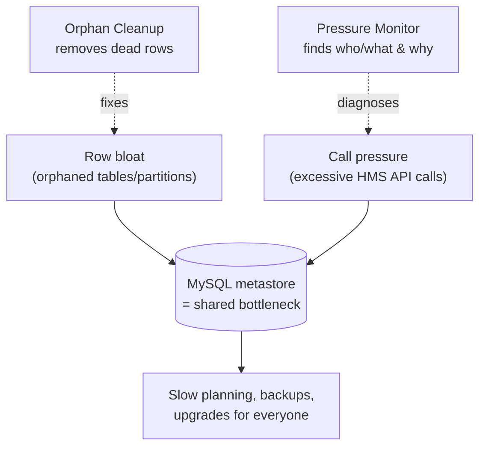
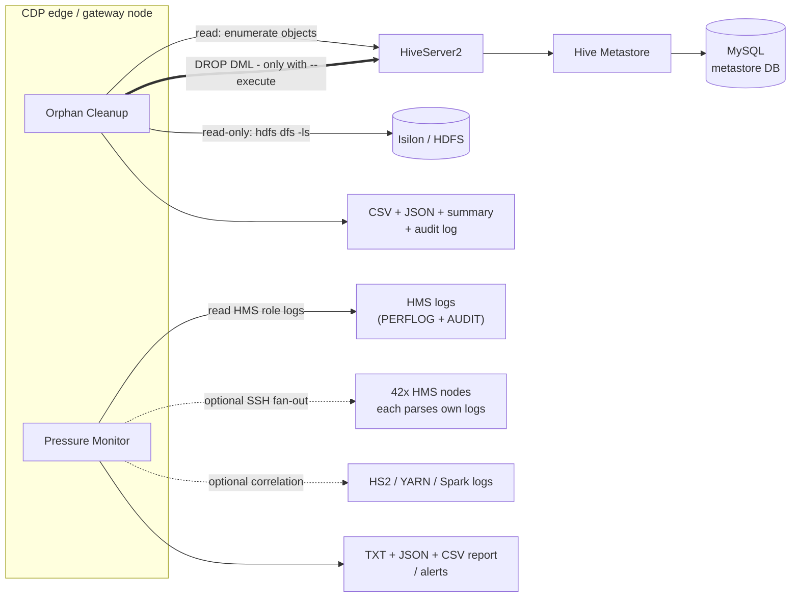
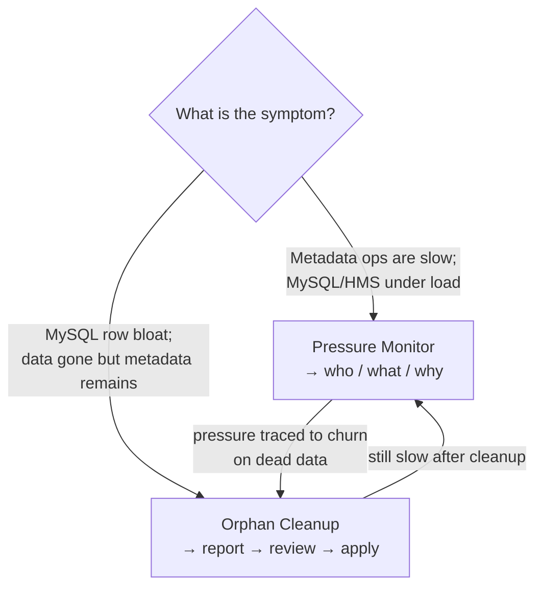
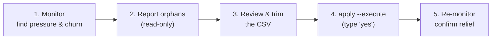

# hive-tools

Operational tooling for keeping a **Hive Metastore (HMS)** and its **MySQL
backend** healthy on **CDP 7.1.9 (Hive 3)** on-prem clusters. Two standalone,
dependency-free Python tools:

| Tool | What it does | Folder |
|------|--------------|--------|
| **Orphan Cleanup** | Finds and removes orphaned Hive tables/partitions (metadata whose storage is gone) via standard Hive DML, reducing metastore rows. | [`orphan-cleanup/`](orphan-cleanup/) |
| **Metadata Pressure Monitor** | Analyzes HMS logs to find what is overloading the metastore/MySQL (hot methods, users, tables, loops), correlates methods to Hive operations and likely source queries/apps (with confidence), and prescribes fixes. Runs fast/incrementally and can fan out across all HMS nodes over SSH. | [`pressure-monitor/`](pressure-monitor/) |

Both are **Python 3.6+ and use only the standard library** - no `pip install`,
no virtualenv required. Copy a script to an edge node and run it.

> **New here?** Take the 5-minute overview tour: open
> [`docs/slides.html`](docs/slides.html) in a browser, or download the
> PowerPoint version
> [`docs/hive-tools-overview.pptx`](docs/hive-tools-overview.pptx) (why the
> tools exist, what they do, and their limits). These READMEs are the
> comprehensive guide.

---

## The problem these tools solve

In a busy Hive 3 cluster the **metastore's MySQL database** is a shared,
single-writer bottleneck. Two things degrade it over time:

1. **Row bloat.** Every table and partition is a set of rows across `TBLS`,
   `PARTITIONS`, `SDS`, `SERDE_PARAMS`, `PARTITION_PARAMS`, `*_COL_STATS`, ...
   When data is
   deleted straight off storage (an Isilon/HDFS `rm`, an expired dataset, a
   dropped external path) the **metadata stays behind as orphans**. Millions of
   dead rows slow every planning query, backup, and upgrade.
2. **Call pressure.** Poorly-shaped workloads hammer the HMS with excessive API
   calls - unfiltered `get_partitions`, per-task delegation-token fetches,
   `MSCK`/add-partition loops, stats storms - and each call is a MySQL round
   trip. The metastore gets slow for *everyone*, but the logs make it hard to
   see **which user, query, or app** is responsible.

These tools address each failure mode, and are designed to be **safe to run on
production**: one is read-only, and the other is read-only by default and only
mutates metadata through standard, reviewed Hive DML.



---

## Systems these tools touch

Both run from a **CDP edge / gateway node**. Only one path can ever change the
cluster - Orphan Cleanup's Hive DML, and only with `--execute`. Everything else
is read-only.



**Legend:** thin arrow = read-only; **thick arrow = potentially mutating** (only
Orphan Cleanup, only with `--execute`, only via Hive DML); dotted = optional.

---

## Which tool do I want?



| If you need to...                                             | Use | Mutates? |
|---------------------------------------------------------------|-----|----------|
| Find **why/who** the metastore is under load                  | [Pressure Monitor](pressure-monitor/) | No (read-only) |
| Attribute load to Hive **operations / queries / apps**        | [Pressure Monitor](pressure-monitor/) | No |
| Remove **stale tables/partitions** whose storage is gone      | [Orphan Cleanup](orphan-cleanup/) | Only with `--execute` |
| Shrink metastore **row counts** on MySQL                      | [Orphan Cleanup](orphan-cleanup/) | Only with `--execute` |

**When NOT to reach for these:** neither tool tunes MySQL itself, changes
Cloudera Manager configs, or deletes user data on purpose. Orphan Cleanup does
**not** find "unused" tables (ones whose data still exists) - only ones whose
`LOCATION` is genuinely missing.

---

## A safe end-to-end workflow



Run the **pressure monitor** to understand load and spot churn, use **orphan
cleanup** to remove the dead metadata inflating row counts, then re-monitor to
confirm the metastore got faster.

---

## Quick start (60 seconds)

Both tools are safe by default (read-only / dry-run) and print what they would
do before changing anything.

### Metadata Pressure Monitor - analyze some HMS logs

```bash
cd pressure-monitor
./metadata_pressure_monitor.py report --paths /var/log/hive --last 24h --output-dir ./out
# -> writes ./out/pressure_report_<ts>.txt (+ .json and CSVs)
```

Gzipped logs, directories, and globs all work. No cluster connection needed -
it just reads logs. For repeated runs add `--state-dir <dir>` to parse only new
log bytes each time; to cover the whole fleet without gathering logs, add
`--hosts <h1,h2,...> --remote-paths '<glob>'` and each HMS node parses its own
logs and returns an aggregate. See the [tool README](pressure-monitor/) for
top-contributor and workload-correlation options.

### Orphan Cleanup - find orphaned objects (read-only)

Run this on a CDP edge node that has `beeline` and `hdfs` on the PATH and a
valid Kerberos ticket:

```bash
cd orphan-cleanup
./hive_orphan_cleanup.py report \
    --jdbc-url 'jdbc:hive2://hs2.example.com:10000/default;principal=hive/_HOST@REALM' \
    --output-dir ./out
# -> writes ./out/orphans_<ts>.csv (+ .json and a summary). Nothing is changed.
```

To actually clean up later, review the report, (optionally trim it,) then run
`apply --report <file> --execute`. You will be shown an itemized plan and must
type `yes`. By default **only EXTERNAL tables/partitions are touched** and
**ACID/transactional tables are never dropped**. See the tool README for details.

---

## Requirements

- **Python 3.6 or newer** (standard library only).
- **Orphan Cleanup** additionally needs, on the machine it runs on:
  - the `beeline` and `hdfs` CLIs (present on any CDP edge/gateway node), and
  - a Kerberos ticket (`kinit`), or a keytab/principal you pass to the tool.
- **Metadata Pressure Monitor** needs only read access to the HMS log files.

There is nothing to install. See [`requirements.txt`](requirements.txt).

---

## Repository layout

```
hive-tools/
├── README.md                     # this file
├── AUDIT.md                      # third-party safety & compatibility audit
├── requirements.txt              # (documents: no third-party deps)
├── .gitignore
├── docs/
│   ├── slides.html               # overview slide deck (open in a browser)
│   ├── hive-tools-overview.pptx  # the same deck as PowerPoint (download)
│   ├── build_pptx.py             # regenerates the .pptx (authoring only)
│   └── assets/                   # diagram PNGs embedded in the .pptx
├── orphan-cleanup/
│   ├── hive_orphan_cleanup.py    # the tool
│   └── README.md                 # full guide
└── pressure-monitor/
    ├── metadata_pressure_monitor.py
    ├── metadata_pressure_monitor.config.example.json
    └── README.md                 # full guide
```

---

## Safety model

At a glance, how much each tool can affect the cluster:

| Aspect | Pressure Monitor | Orphan Cleanup |
|--------|------------------|----------------|
| Reads | HMS logs (+ optional HS2/YARN/Spark) | HMS via beeline; storage via `hdfs -ls` |
| Writes to cluster | **Never** | Only Hive DML, only with `--execute` |
| Deletes data | Never | Never for EXTERNAL; only for MANAGED with `--allow-managed`; **never** for ACID |
| Default posture | Read-only | Dry-run (prints plan, changes nothing) |
| Blast-radius guards | n/a | external-only, ACID-protected, positive-proof, bulk guard, typed `yes` |
| Worst-case if misused | A stale report | Bounded by the gates above + your `--databases`/`--limit` scope |

- **Pressure Monitor** is strictly **read-only**. It never touches the cluster;
  it only reads logs and writes reports/alerts.
- **Orphan Cleanup** is conservative by default and designed for production:
  - **Dry-run by default** - DML is only issued with `--execute`.
  - **External-only by default** - dropping a MANAGED table deletes data, so
    managed objects are skipped unless you pass `--allow-managed`.
  - **ACID/transactional tables are never auto-dropped** (hard rule).
  - **Positive proof of absence** - an object is dropped only when its parent
    directory lists successfully *and* the object is genuinely missing; any
    transient storage error is skipped, so an Isilon/NameNode blip can't
    manufacture orphans.
  - **Bulk-safety guard** - refuses to act on a suspiciously large set
    (`--max-drops`, `--max-orphan-pct`) unless `--allow-bulk`, since that
    usually signals a storage outage rather than real orphans.
  - **Notify + confirm** - prints an itemized plan and requires you to type
    `yes` (or pass `--yes` for automation); writes an audit log of every
    statement. Uses **standard Hive DML** only - never raw `DELETE` against the
    metastore database.

---

## Caveats & limitations

- **CDP 7.1.9 / Hive 3, on-prem.** Built and verified against this stack (RHEL 8,
  Isilon OneFS HDFS, MySQL metastore). Other versions may work but are untested.
- **Orphan Cleanup needs a healthy filesystem view.** It decides "orphaned" from
  what `hdfs dfs -ls` reports. Run it when Isilon/HDFS and the NameNode are
  healthy; the bulk guard is a backstop, not a substitute for that check.
- **"Orphaned" ≠ "unused."** A table whose data still exists is never flagged,
  even if nobody queries it. This tool only removes metadata whose storage is
  genuinely gone.
- **Pressure Monitor correlation is best-effort.** HMS audit logs share no id
  with HS2/YARN/Spark, so source attribution is a **ranked guess with a
  confidence score** unless client logs confirm it. Treat the Top-5 as leads.
- **Logs must be readable and reasonably standard.** Parsing targets Cloudera
  HMS role logs (PERFLOG + AUDIT). Heavily customized log4j layouts may need
  tweaks.
- **Back up the metastore** (MySQL dump) before large cleanups, per normal
  change control.

---

## Pushing to GitHub

This directory is a ready-to-push git repository. After creating an empty repo
on your Git host:

```bash
cd /Users/whouseholder/Documents/GitHub/hive-tools
git remote add origin <your-repo-url>
git push -u origin main
```
