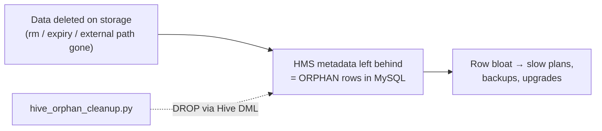
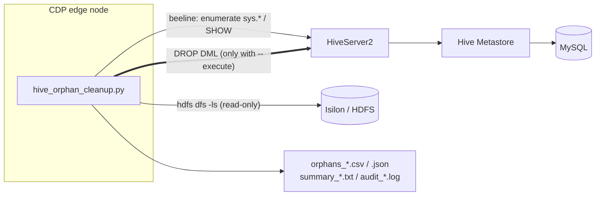
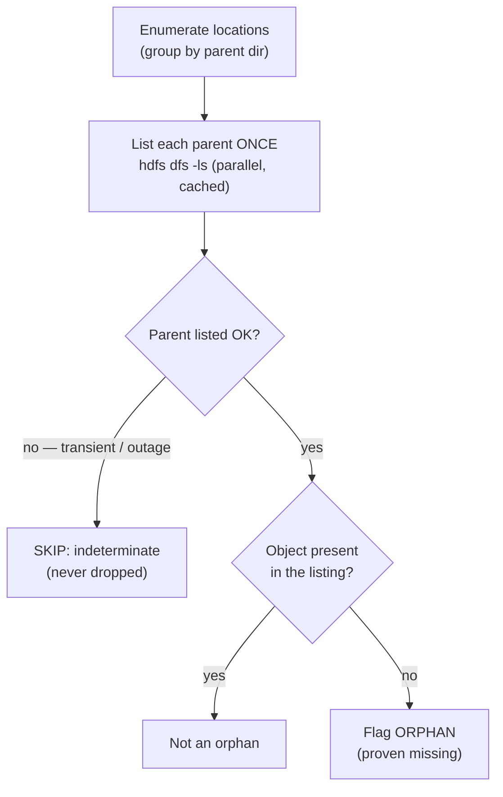
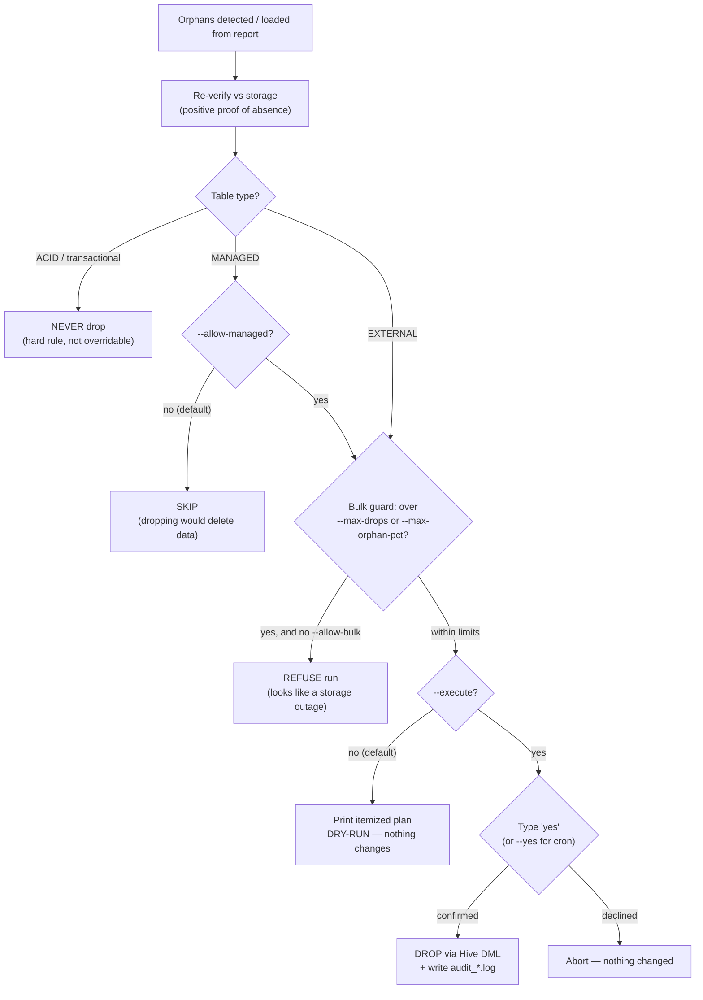

# Hive Orphan Object Cleanup (CDP 7.1.9 + Isilon)

`hive_orphan_cleanup.py` finds and removes **orphaned** Hive objects: tables or
partitions that still exist in the Hive Metastore (HMS, backed by MySQL) but
whose storage `LOCATION` is gone from the filesystem (e.g. Isilon / HDFS).

Cleanup uses only **standard Hive DML** (`DROP TABLE`,
`ALTER TABLE ... DROP PARTITION`, `MSCK REPAIR ... DROP PARTITIONS`). Dropping an
object cascades away its rows in the metastore backing tables
(`TBLS`/`PARTITIONS`/`SDS`/`SERDE_PARAMS`/`PARTITION_PARAMS`/`PART_COL_STATS`,
...) - which is how it reduces object count on the MySQL side.

## The problem

When data is removed straight off storage - an Isilon/HDFS `rm`, an expired
dataset, a decommissioned external path - Hive's metadata is **not** cleaned up
with it. The `TBLS`/`PARTITIONS`/`SDS`/... rows linger in MySQL as **orphans**.
Over months these accumulate into millions of dead rows that slow every query
plan, metastore backup, and CDP upgrade. This tool finds those orphans (metadata
with a genuinely missing `LOCATION`) and removes just the metadata, safely.



## When to use it (and when not)

**Use it when:**

- You know data was deleted/expired on Isilon/HDFS outside Hive and want the
  stale metadata gone.
- MySQL row counts (`TBLS`/`PARTITIONS`) are large and metastore ops feel slow.
- You want a **read-only inventory** of orphaned objects before deciding.

**Do not use it (or use with care) when:**

- **Storage is unhealthy.** If Isilon/HDFS or the NameNode is degraded,
  everything can look "missing." Wait until healthy; the bulk guard is only a
  backstop.
- **You want to find *unused* tables.** Orphan = storage genuinely gone. A table
  whose data still exists is never flagged, however idle.
- **You need to reclaim disk.** This removes *metadata*, not data (the data is
  already gone). Use it to shrink the metastore, not the filesystem.

**Caveats:** MANAGED-table cleanup deletes data and is opt-in (`--allow-managed`);
ACID tables are never dropped; `MSCK ... DROP PARTITIONS` (`--use-msck`) can drop
many partitions on a transient outage - prefer the default explicit drops. See
[Safety model](#safety-model) below.

## Requirements

- A CDP 7.1.9 edge/gateway node with `beeline` and `hdfs` on `PATH`.
- **RHEL 8 compatible**: Python 3.6+ (RHEL 8 ships 3.6), standard library only -
  nothing to install. Run as `./hive_orphan_cleanup.py` or `python3
  hive_orphan_cleanup.py` (or `/usr/libexec/platform-python` on a minimal host).
- A valid Kerberos ticket (`kinit`), or pass `--keytab`/`--principal` and the
  tool will `kinit` for you.
- Uses Hive 3 `sys.*` metastore views (present in CDP 7.1.9), automatically
  falling back to `SHOW`/`DESCRIBE` if `sys.*` is not reachable.

## The 30-second version (recommended: report -> review -> apply)

```bash
# 1) See what's orphaned (READ-ONLY, changes nothing)
./hive_orphan_cleanup.py report \
    --jdbc-url 'jdbc:hive2://hs2.example.com:10000/default;principal=hive/_HOST@REALM' \
    --output-dir ./out

# 2) Review ./out/summary_<ts>.txt and ./out/orphans_<ts>.csv.
#    Optionally open the CSV and delete any rows you do NOT want to act on.

# 3) Clean exactly the rows in that (optionally trimmed) report.
#    You'll be shown an itemized DROP plan and prompted to type 'yes'.
./hive_orphan_cleanup.py apply --report ./out/orphans_<ts>.csv            # dry-run preview
./hive_orphan_cleanup.py apply --report ./out/orphans_<ts>.csv --execute  # prompts for 'yes'

# (Alternative) detect + clean in one shot, dry-run first:
./hive_orphan_cleanup.py clean --output-dir ./out                        # dry-run preview
./hive_orphan_cleanup.py clean --output-dir ./out --execute              # prompts for 'yes'
```

Defaults are deliberately cautious: **dry-run** unless `--execute`;
**EXTERNAL-only** (managed tables need `--allow-managed`); **ACID tables are
never dropped**; and a **bulk-safety guard** stops suspiciously large runs.
Options may be given after the subcommand (e.g. `report --jdbc-url ...`).

## Modes

| Mode     | What it does                                                        | Mutates? |
|----------|--------------------------------------------------------------------|----------|
| `report` | Enumerate HMS, check storage, write CSV + JSON + human summary.    | No |
| `clean`  | Detect **and** clean. Dry-run by default; needs `--execute`.       | With `--execute` |
| `apply`  | Clean exactly the objects listed in a prior (optionally trimmed) report. | With `--execute` |

## How detection works

1. **Enumerate** all table and partition locations in one shot from the Hive 3
   `sys.*` views (`sys.TBLS`/`DBS`/`SDS`/`PARTITIONS`), falling back to
   `SHOW DATABASES` -> `SHOW TABLES` -> `DESCRIBE FORMATTED` / `SHOW PARTITIONS`.
2. **Check storage** with `hdfs dfs`, batched by **parent directory**: every
   unique parent (a database dir for tables, a table dir for partitions) is
   listed **once** with `hdfs dfs -ls` and cached, shared across both tables and
   partitions. Hundreds of tables in one database, or thousands of partitions
   under one table, then cost a single listing instead of one probe per object -
   which keeps load off the NameNode/Isilon on large, repeated runs. Listings
   for distinct parents run in parallel (`--max-workers`).
3. **Classify** an object as orphaned only with **positive proof of absence**:
   the parent directory must list successfully (`hdfs dfs -ls`) *and* the object
   must genuinely not be in that listing. Because `hdfs dfs -test -e` returns the
   same exit code for "missing" and for many transient errors, the tool never
   relies on that alone (unless you explicitly pass `--no-require-parent-exists`).
   Any indeterminate result - unreachable parent, transient Isilon/NameNode
   error - is **skipped**, so an outage cannot manufacture orphans.

### Systems & data flow



Thin arrow = read-only; **thick arrow = the only mutating path** (Hive DML,
`--execute` only). No raw `DELETE` is ever issued against MySQL.

### Detection decision (per object)

Conservative by construction - an object is flagged only with **positive proof
of absence**; anything uncertain is left alone:



## Safety model

Before anything is dropped, an object passes through a fixed **ordered set of
gates**. Each gate is conservative by default; the override for one gate never
weakens the others.



### The gates, in order

| # | Gate | Default (safe) | Loosen with | Loosening does **not** bypass |
|---|------|----------------|-------------|-------------------------------|
| 1 | Dry-run | On - prints plan, issues no DML | `--execute` | any gate below |
| 2 | External-only | MANAGED objects skipped | `--allow-managed` (deletes data) | ACID protection |
| 3 | ACID protection | Transactional tables never dropped | *(no override)* | - |
| 4 | Positive proof | Parent must list AND object absent | `--no-require-parent-exists` (discouraged) | - |
| 5 | Bulk guard | Refuse > `--max-drops` / `--max-orphan-pct` | `--allow-bulk` | external-only, ACID |
| 6 | Typed confirmation | Must type the word `yes` | `--yes` (for non-TTY) | external-only, ACID, bulk guard |

The takeaway: `--yes` only skips the *keystroke*, `--allow-bulk` only skips the
*size* check, and `--allow-managed` only opts into *managed* objects. None of
them can drop an ACID table or act on an indeterminate storage result.

## What the tool will and will not drop

| Object | Default (`clean`/`apply`) | With `--allow-managed` |
|--------|---------------------------|------------------------|
| EXTERNAL table / partition, proven missing | **Dropped** (after confirm) | Dropped |
| MANAGED table / partition, proven missing | **Skipped** (reported) | Dropped (after confirm) |
| ACID / transactional table | **Never dropped** | **Never dropped** |
| VIEW | Never touched | Never touched |
| Location present or indeterminate | Never dropped | Never dropped |

Dropping a MANAGED object deletes its data, so managed objects are opt-in; ACID
tables are protected unconditionally.

### Bulk-safety guard

Before executing, the tool refuses to proceed if the actionable set is
suspiciously large - more than `--max-drops` objects (default 500) or more than
`--max-orphan-pct` of scanned tables (default 25%) - unless you pass
`--allow-bulk`. A large orphan set almost always means a storage outage, not
real orphans. This guard is independent of `--yes`.

## Reports

Each run writes to `--output-dir`:

- `orphans_<ts>.csv` - one row per orphaned object. Columns:
  `object_type, db, table, tbl_type, partition_spec, location, reason, detected_at`.
- `orphans_<ts>.json` - the same data plus scan stats and recommendations.
- `summary_<ts>.txt` - counts, per-table breakdown, an estimate of metastore
  rows reclaimed, and recommendations.

`clean`/`apply` also write `audit_<ts>.log` (one line per statement executed).

### Trimming a report for `apply`

Open a prior `orphans_*.csv`, delete the rows you do **not** want to act on
(keep the header), save, then run `apply --report <file> --execute`. Every
remaining row is re-verified against storage immediately before its DROP unless
you pass `--skip-reverify`.

## MySQL-load-reducing housekeeping (opt-in)

Report-only in `report` mode; executed in `clean` with `--execute`:

- **`--set-retention DAYS`** - on partitioned **external** tables, sets
  `discover.partitions=true` and `partition.retention.period=<DAYS>d` so Hive
  auto-expires old partition metadata.
- **`--compact`** - requests `ALTER TABLE ... COMPACT 'major'` on ACID tables;
  after the Compaction Cleaner runs, this shrinks `TXN_COMPONENTS`,
  `COMPLETED_TXN_COMPONENTS`, and `WRITE_SET`.
- **Stats bloat** - no separate action needed: dropping orphaned
  partitions/tables cascades their `PART_COL_STATS`/`TAB_COL_STATS` rows.

The report also emits **config-level recommendations** applied via Cloudera
Manager (not by this tool), e.g. lowering
`hive.metastore.event.db.listener.timetolive` to prune `NOTIFICATION_LOG`. The
tool never issues raw `DELETE` against metastore tables.

## Key options

| Option | Purpose |
|--------|---------|
| `--jdbc-url` | HiveServer2 JDBC URL for beeline (or set `HOC_JDBC_URL`). |
| `--beeline-path` / `--hdfs-path` | Override CLI binary locations. |
| `--keytab` / `--principal` | Optional pre-run `kinit`. |
| `--databases` / `--exclude-databases` / `--tables` / `--table-regex` | Scope the scan. |
| `--require-parent-exists` / `--no-require-parent-exists` | Toggle positive parent-listing corroboration (default **on**; leave on in production). |
| `--max-workers` | Parallel `hdfs` existence checks (default 8). |
| `--execute` | Actually run DML (otherwise dry-run). |
| `--yes` | Skip the interactive `yes` prompt (needed for cron/non-TTY). Does **not** bypass the managed/ACID or bulk-safety gates. |
| `--allow-managed` | Also act on MANAGED (non-ACID) objects. **Deletes data** for genuine orphans. Off by default. |
| `--allow-bulk` | Override the bulk-safety guard. Use only after confirming storage is healthy. |
| `--max-drops N` | Refuse to act on more than N objects unless `--allow-bulk` (default 500). |
| `--max-orphan-pct P` | Refuse if more than P% of scanned tables look orphaned, unless `--allow-bulk` (default 25). |
| `--confirm-each` | Prompt interactively before each per-table DROP batch. |
| `--limit N` | Cap the number of per-table batches acted on. |
| `--use-msck` | Use `MSCK REPAIR ... DROP PARTITIONS` per table. **Caution:** this drops *every* partition whose directory is currently missing, so a transient outage could drop many partitions. Prefer the default explicit `ALTER ... DROP PARTITION`. |

Exit codes: `0` success, `1` runtime error, `2` some DML statements failed,
`3` soft warning / stopped safely (empty report, aborted at the prompt, or the
bulk-safety guard refused the run).

## Scheduling

Schedule **reporting** only. Execution should stay a human-reviewed step, so a
storage outage can never turn into an automated mass-drop.

```cron
# Weekly Mon 02:00 read-only report
0 2 * * 1 /opt/hive-tools/orphan-cleanup/hive_orphan_cleanup.py report \
    --keytab /etc/security/keytabs/hive.keytab --principal hive/edge01@REALM \
    --jdbc-url 'jdbc:hive2://hs2:10000/default;principal=hive/_HOST@REALM' \
    --output-dir /var/log/hms_orphans >> /var/log/hms_orphans/cron.log 2>&1
```

Then, after a human reviews and trims the weekly report:

```bash
# --yes is required on a non-TTY; the managed/ACID and bulk-safety gates still apply.
./hive_orphan_cleanup.py apply --report /var/log/hms_orphans/orphans_<ts>.csv --execute --yes \
    --keytab /etc/security/keytabs/hive.keytab --principal hive/edge01@REALM
```

## Safety notes

- **Dry-run is the default**; nothing changes without `--execute`.
- **EXTERNAL-only by default**; MANAGED objects require `--allow-managed`, and
  **ACID/transactional tables are never dropped**.
- Every object is re-verified against storage with **positive proof of absence**
  immediately before its DROP; indeterminate results are skipped.
- The **bulk-safety guard** stops runs that look like a storage outage
  (`--max-drops`, `--max-orphan-pct`) unless `--allow-bulk`.
- Before any execute you get an **itemized plan** and must type **`yes`**
  (or pass `--yes`); every statement is written to `audit_<ts>.log`.
- Scope with `--databases`/`--tables` if unsure, and use `--limit` on the first
  execute run to bound blast radius. Prefer explicit partition drops over
  `--use-msck`.
